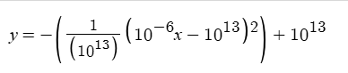

# Bonding Curve

Cafee.fun use it's own bonding curve . Design by cafeefun team .

A stable and good bonding curve should be able to meet the price curve .&#x20;

## Base Bonding Curve

We limit for follow limits :&#x20;

* X : ETH amount/number ( Decimals 18 )
* Y : Token Amounts ( Decimals 6)
* X <= 10 (When it reach 10 , auto turn it into uniswap liqudity)

<figure><figcaption><p>X=>Y</p></figcaption></figure>

As for Y=> X&#x20;

<figure><figcaption><p>Y=>X</p></figcaption></figure>

Follow this curve , we can get a bonding curve that meet the final price curve at 10 ETH


## Solidity Achive

The bonding curve in solidity can be build as&#x20;

```solidity
/**
    Function about bonding curve design

    X>0

    X<1e19

    Y>0
    
    Y<1e13
 */
    
    uint256 constant m = 1e13;       // Equivalent to 10000000000000 in Solidity
    uint256 constant scaleFactor = 1e6;  // Represents the divisor for the 10^-6 scaling factor
    // Function to compute Y based on input X
    function xtoy(uint256 x) public pure returns (uint256) {
        // Scale down x by dividing by scaleFactor (equivalent to x * 10^-6 in Python)
        uint256 scaledX = x / scaleFactor;
        // Calculate the term (scaledX - m) and square it
        uint256 term = scaledX > m ? scaledX - m : m - scaledX;  // abs(scaledX - m)
        uint256 termSquared = (term * term) / m;                // term^2 / 
        // Calculate final result
        return m > termSquared ? m - termSquared : 0;

    }
    function ytox(uint256 y) public pure returns (uint256) {
        require(y <= m, "y must be less than or equal to m"); // Ensure y is within bounds

        // Calculate sqrt(m * (m - y))
        uint256 diff = m - y;
        uint256 sqrtTerm = sqrt(m * diff);
        // Calculate x based on the positive root of the equation
        uint256 x = (m - sqrtTerm) * scaleFactor;  // Multiply by scaleFactor to reverse 10^-6 scaling

        return x;
    }

    function sqrt(uint256 value) internal pure returns (uint256) {
        if (value == 0) return 0;
        uint256 z = (value + 1) / 2;
        uint256 y = value;
        while (z < y) {
            y = z;
            z = (value / z + z) / 2;
        }
        return y;
    }

/**
Price assume . how much in . how much out
 */

    function buyAmountsOut(uint256 amountIn) public view returns(uint256) {

        uint256 from = xtoy(vault);
        uint256 _to = vault+amountIn;
        if(vault+amountIn>top)
        {
            _to = top;
        }
        uint256 to = xtoy(vault+amountIn);

        return to-from;
    }


    function sellAmountsOut(uint256 amountIn) public view returns(uint256) {

        uint256 from = ytox(
           totalSupply - IERC20(token).balanceOf(address(this))
        );
        uint256 to = ytox(
            totalSupply - (IERC20(token).balanceOf(address(this))+amountIn)
        );

        return from-to;
    }

```

We can buy and sell token in curve with function `buyAmountsOut` and `sellAmountsOut` .
